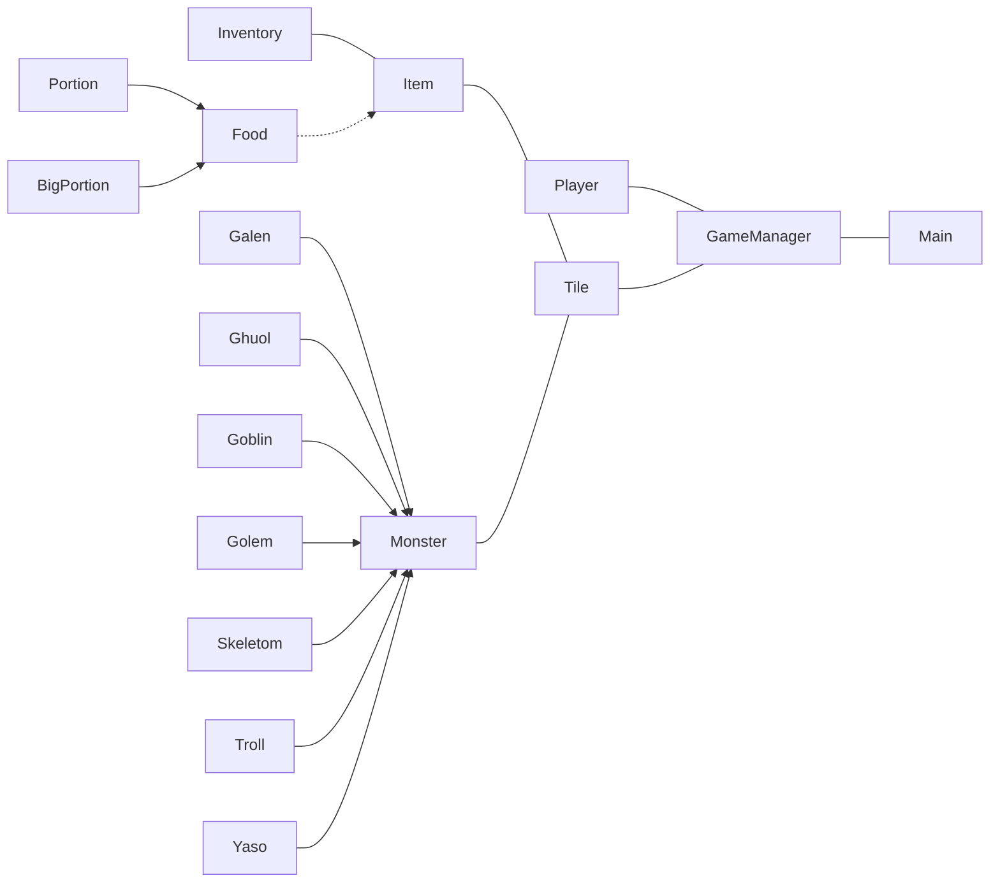

# Console Roguelike Game

    
RoguelikeRPG project is intended to become familiar with Java classes. Finished designing the class, **now writing data input/output**. a lot of exceptions left, but this should be done after I / O is finished. 

## Project Environment

- Windows 10 (build 18363.720)
- JDK Compiler Version 1.8
- Code text encoding used MS949

## Class Diagram

